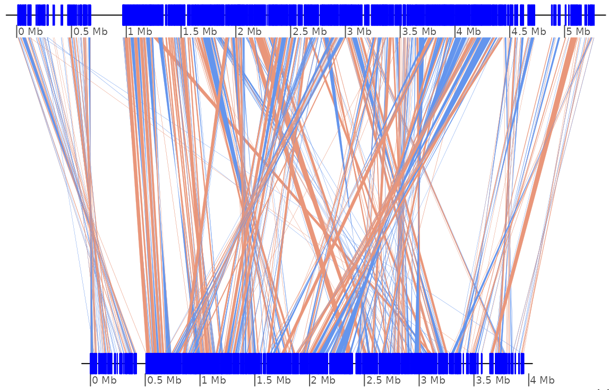

GenomicBreaks
=============

Purpose
-------

_GenomicBreaks_ is a `R` package using _[Bioconductor](https://bioconductor.org/)_
libraries to analyse pairwise alignments of whole genomes in which the gene
order has been scrambled by evolution, like in the picture below that represents
the comparison of homologous chromosomes in two distantly related molds,
_N. crassa_ (chrIII) and _P. comata_ (chr7).

<center></center>

This package is especially designed to parse and process the alignment files
produced by the our [pairwise genome alignment
pipeline](https://github.com/oist/plessy_pairwiseGenomeComparison), but should
be capable to import output of other pipelines as well.

Installation
------------

### Install the package.

The following should work:

```
Rscript -e 'remotes::install_github("oist/GenomicBreaks", repos=BiocManager::repositories())'
```

Add `dependencies=TRUE` if you would like to install the packages needed to build the vignettes.

### How to install R 4.1, Rstudio and Bioconductor.

On a Debian/Ubuntu system, try this:

```
sudo apt install r-base
sudo apt install pandoc qpdf texlive # For vignette builds and package checks
sudo apt install libxml2-dev libcurl4-openssl-dev libssl-dev libfftw3-dev libtiff-dev libgsl-dev
sudp atp install libfontconfig1-dev libharfbuzz-dev libfribidi-dev # For pkgdown
sudo apt install git bash-completion
sudo apt install libgl1 libnss3 libasound2 libxdamage1 libbz2-dev liblzma-dev libfftw3-dev
wget https://download1.rstudio.org/desktop/bionic/amd64/rstudio-2021.09.0-351-amd64.deb
sudo apt --fix-broken -y install ./rstudio-2021.09.0-351-amd64.deb
Rscript -e 'install.packages("BiocManager")'
Rscript -e 'install.packages("tidyverse")'
Rscript -e 'install.packages("devtools")' 
Rscript -e 'install.packages("remotes")'
Rscript -e 'remotes::install_github("oist/GenomicBreaks", repos=BiocManager::repositories(), dependencies=TRUE)'

```

GenomicBreaks in brief:
-----------------------

A pairwise alignment of two genomes is loaded in `GBreaks` objects wrapping
the `GRanges` class.  Here is an example:

```
GBreaks object with 11 ranges and 2 metadata columns:
       seqnames            ranges strand |                  query     score
          <Rle>         <IRanges>  <Rle> |              <GRanges> <integer>
   [1]     chr1 11256821-11271214      - |   Chr1:7699877-7713142     14394
   [2]     chr1 11271261-11272159      - |   Chr1:7975442-7976321       899
   [3]     chr1 11272246-11274272      + |   Chr1:7686802-7688942      2027
   [4]     chr1 11275227-11276200      - |   Chr1:7491169-7492136       974
   [5]     chr1 11276902-11281111      - |   Chr1:7850371-7855204      4210
   [6]     chr1 11281154-11281731      + |  PAR:10891068-10891635       578
   [7]     chr1 11281946-11288799      + |   Chr2:9359434-9367027      6854
   [8]     chr1 11288839-11299743      - | Chr1:10912857-10921537     10905
   [9]     chr1 11300902-11301564      - |   Chr1:9597979-9599493       663
  -------
  seqinfo: 19 sequences from OKI2018_I69 genome
```

See “_Get started_” on <https://oist.github.io/GenomicBreaks> for further details.
