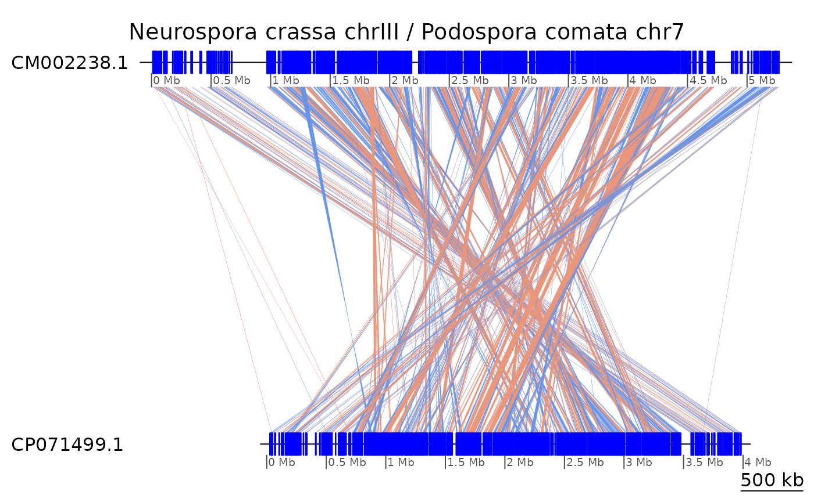
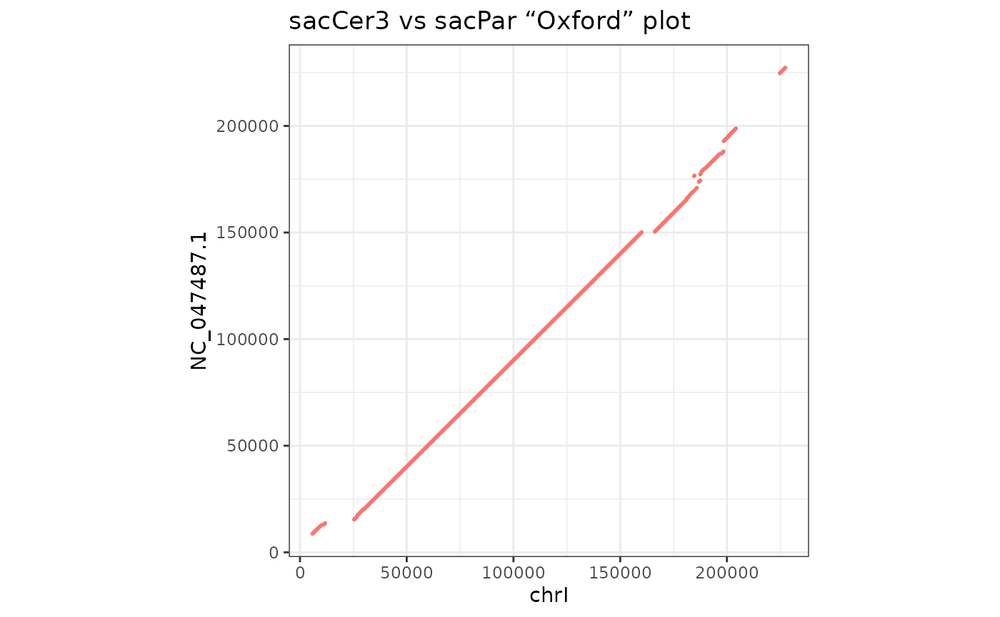
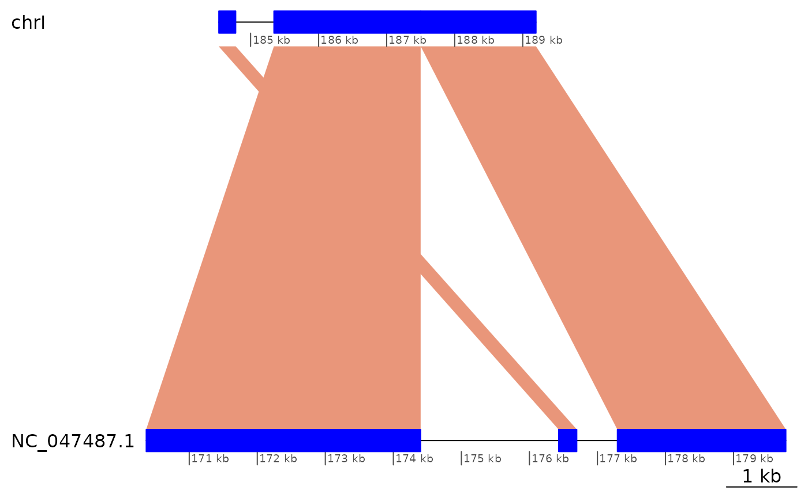
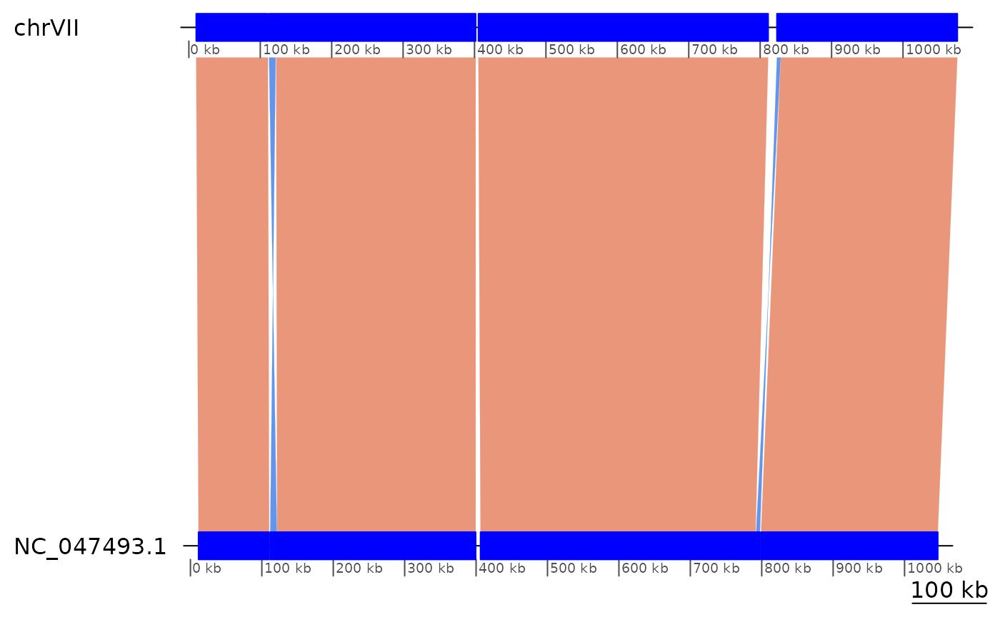

# Introduction to GenomicBreaks

``` r
knitr::opts_chunk$set(cache = TRUE)
knitr::opts_knit$set(verbose = TRUE)
```

## Introduction

The *GenomicBreaks* R package contains tools for visualising and
analysing characteristics associated with *breakpoints* between pairs of
*genomes*.

### Load pacakges

By loading *GenomicBreaks*, the *GenomicRanges* package is automatically
loaded too. But we have to load *ggplot2* if we want to customise the
output of the plotting functions of *GenomicBreaks*.

``` r
library('GenomicBreaks') |> suppressPackageStartupMessages()
library('ggplot2')
```

We will use yeast data as an example. The genome of *Saccharomyces
cerevisiae* is available in Bioconductor so let’s load its BSgenome
package. After loading a `Scerevisiae` object is invisibly exported.

``` r
library("BSgenome.Scerevisiae.UCSC.sacCer3") |> suppressPackageStartupMessages()
```

### Example data

This package contains example data files representing the alignment of
two closely related *Saccharomyces* yeast genomes, and of two more
distantly related homologous chromosomes of *Sordariomycetes*
filamentous fungi.

#### *Saccharomyces cerevisiae* – *S. paradoxus*

Alignment of the *Saccharomyces paradoxus* genome version `ASM207905v1`
to the `SacCer3` reference genome of *S. cerevisiae*, produced with the
Nextflow [pairwise alignment
pipeline](https://github.com/oist/plessy_pairwiseGenomeComparison) and
converted to
[GFF3](https://github.com/The-Sequence-Ontology/Specifications/blob/master/gff3.md)
format with the `maf-convert gff -J 1000000` command of the
[LAST](https://gitlab.com/mcfrith/last/-/blob/main/doc/maf-convert.rst)
package.

Note that the since *GenomicBreaks* can also load alignments in MAF
format directly, (see
[`load_genomic_breaks()`](https://oist.github.io/GenomicBreaks/reference/load_genomic_breaks.md))
you usually do not need to convert the pipeline output to GFF3 format.

``` r
exdata_Sac <- system.file("extdata/SacCer3__SacPar.gff3.gz", package = "GenomicBreaks")
```

#### *Neurospora crassa* chromosome III – *Podospora comata* chromosome 7

Alignment of the *Neurospora crassa* genome version `NC12` downloaded
from ENSEMBL 52, to the *Podospora comata* genome version `ASM1735489v1`
downloaded from `GenBank`, produce with the same commands as above. The
alignment was then filtered to reduce the size and complexity of the
example data, by retaining only the matches between chromosome III and
chromosome 7 (`CP071499`).

``` r
exdata_Neu <- system.file("extdata/NeuCra__PodCom.III__7.gff3.gz", package = "GenomicBreaks")
```

## GBreaks objects

Pairwise genome alignments are loaded in
[`GBreaks()`](https://oist.github.io/GenomicBreaks/reference/GBreaks-class.md)
objects that wrap the `GRanges` class. By convention, we write that the
*query* genome (the one that was provided as a FASTA file) is aligned to
the *target* genome (the one that was indexed by the aligner). The
*target* genome (on the left) is the main part of the object, and the
*query* genome information (right) is contained in the metadata columns
(`mcols`) of the structure. Information on contig or scaffold length is
optionaly loaded from `BSgenome` objects, from which `seqinfo` data is
extracted and passed to the `GRanges`. By convention, strand information
of the alignment is held by the *target* `GRanges`, and the *query*
`GRanges` are strandless. The objects are sorted by `seqname` first.

``` r
gb <- load_genomic_breaks(exdata_Sac, Scerevisiae)
gb
```

    ## GBreaks object with 505 ranges and 2 metadata columns:
    ##         seqnames      ranges strand |     score                   query
    ##            <Rle>   <IRanges>  <Rle> | <numeric>               <GRanges>
    ##     [1]     chrI  5860-10010      + |     10609  NC_047487.1:8723-12716
    ##     [2]     chrI 11157-11782      + |      1253 NC_047487.1:13035-13680
    ##     [3]     chrI 25371-26528      + |      3651 NC_047487.1:15380-16537
    ##     [4]     chrI 26849-29699      + |      6130 NC_047487.1:17263-20175
    ##     [5]     chrI 29937-30607      + |       767 NC_047487.1:20203-20866
    ##     ...      ...         ...    ... .       ...                     ...
    ##   [501]     chrM 67039-67870      + |      1441   NC_018044.1:7758-8439
    ##   [502]     chrM 68205-68580      + |       830   NC_018044.1:8783-9180
    ##   [503]     chrM 69178-76168      + |     14528  NC_018044.1:9650-16261
    ##   [504]     chrM 77356-80022      + |      8066 NC_018044.1:53206-55865
    ##   [505]     chrM 80919-85779      + |      6712 NC_018044.1:57885-61592
    ##   -------
    ##   seqinfo: 17 sequences (1 circular) from sacCer3 genome

``` r
gb$query
```

    ## GRanges object with 505 ranges and 0 metadata columns:
    ##            seqnames      ranges strand
    ##               <Rle>   <IRanges>  <Rle>
    ##     [1] NC_047487.1  8723-12716      *
    ##     [2] NC_047487.1 13035-13680      *
    ##     [3] NC_047487.1 15380-16537      *
    ##     [4] NC_047487.1 17263-20175      *
    ##     [5] NC_047487.1 20203-20866      *
    ##     ...         ...         ...    ...
    ##   [501] NC_018044.1   7758-8439      *
    ##   [502] NC_018044.1   8783-9180      *
    ##   [503] NC_018044.1  9650-16261      *
    ##   [504] NC_018044.1 53206-55865      *
    ##   [505] NC_018044.1 57885-61592      *
    ##   -------
    ##   seqinfo: 17 sequences from an unspecified genome; no seqlengths

``` r
# No BSgenome available for N. crassa and P. comata.
# This data does not contain match_part entries, so set the type parameter.
gb_Neu <- load_genomic_breaks(exdata_Neu, type = "match")
```

### Maniuplation of GBreaks objects with plyranges

With the *plyranges* Bioconductor package it is easy to manipulate
`GBreaks` objects, in particular when filtering on features of the
*query* genome. This package is not automatically installed; so you may
need to do it yourself.

``` r
# BiocManager::install('plyranges')

# Subset for chrI on the target genome.
gb |> plyranges::filter(seqnames == "chrI")
```

    ## GBreaks object with 22 ranges and 2 metadata columns:
    ##        seqnames        ranges strand |     score                     query
    ##           <Rle>     <IRanges>  <Rle> | <numeric>                 <GRanges>
    ##    [1]     chrI    5860-10010      + |     10609    NC_047487.1:8723-12716
    ##    [2]     chrI   11157-11782      + |      1253   NC_047487.1:13035-13680
    ##    [3]     chrI   25371-26528      + |      3651   NC_047487.1:15380-16537
    ##    [4]     chrI   26849-29699      + |      6130   NC_047487.1:17263-20175
    ##    [5]     chrI   29937-30607      + |       767   NC_047487.1:20203-20866
    ##    ...      ...           ...    ... .       ...                       ...
    ##   [18]     chrI 197472-198417      + |       644 NC_047487.1:187015-188000
    ##   [19]     chrI 198484-200975      + |      9880 NC_047487.1:192875-195376
    ##   [20]     chrI 200976-204211      + |     11801 NC_047487.1:195559-198812
    ##   [21]     chrI 205647-208058      + |      8709 NC_047494.1:515228-517518
    ##   [22]     chrI 224773-227362      + |     11047 NC_047487.1:224711-227317
    ##   -------
    ##   seqinfo: 17 sequences (1 circular) from sacCer3 genome

``` r
# Subset for NC_047487.1 on the query genome
gb |> plyranges::filter(seqnames(query) == "NC_047487.1")
```

    ## GBreaks object with 24 ranges and 2 metadata columns:
    ##        seqnames        ranges strand |     score                     query
    ##           <Rle>     <IRanges>  <Rle> | <numeric>                 <GRanges>
    ##    [1]     chrI    5860-10010      + |     10609    NC_047487.1:8723-12716
    ##    [2]     chrI   11157-11782      + |      1253   NC_047487.1:13035-13680
    ##    [3]     chrI   25371-26528      + |      3651   NC_047487.1:15380-16537
    ##    [4]     chrI   26849-29699      + |      6130   NC_047487.1:17263-20175
    ##    [5]     chrI   29937-30607      + |       767   NC_047487.1:20203-20866
    ##    ...      ...           ...    ... .       ...                       ...
    ##   [20]     chrI 200976-204211      + |     11801 NC_047487.1:195559-198812
    ##   [21]     chrI 224773-227362      + |     11047 NC_047487.1:224711-227317
    ##   [22]   chrVII 402974-403256      + |       730 NC_047487.1:179771-180020
    ##   [23]  chrVIII 527711-528802      + |      3617 NC_047487.1:202798-203906
    ##   [24]  chrVIII 530396-533532      + |      6424 NC_047487.1:205275-208524
    ##   -------
    ##   seqinfo: 17 sequences (1 circular) from sacCer3 genome

``` r
# Add or modify columns on the fly
gb |> plyranges::mutate("Width" = width) |> head(3)
```

    ## GBreaks object with 3 ranges and 3 metadata columns:
    ##       seqnames      ranges strand |     score                   query     Width
    ##          <Rle>   <IRanges>  <Rle> | <numeric>               <GRanges> <integer>
    ##   [1]     chrI  5860-10010      + |     10609  NC_047487.1:8723-12716      4151
    ##   [2]     chrI 11157-11782      + |      1253 NC_047487.1:13035-13680       626
    ##   [3]     chrI 25371-26528      + |      3651 NC_047487.1:15380-16537      1158
    ##   -------
    ##   seqinfo: 17 sequences (1 circular) from sacCer3 genome

``` r
gb |> plyranges::mutate("score" = width) |> head(3)
```

    ## GBreaks object with 3 ranges and 2 metadata columns:
    ##       seqnames      ranges strand |     score                   query
    ##          <Rle>   <IRanges>  <Rle> | <integer>               <GRanges>
    ##   [1]     chrI  5860-10010      + |      4151  NC_047487.1:8723-12716
    ##   [2]     chrI 11157-11782      + |       626 NC_047487.1:13035-13680
    ##   [3]     chrI 25371-26528      + |      1158 NC_047487.1:15380-16537
    ##   -------
    ##   seqinfo: 17 sequences (1 circular) from sacCer3 genome

``` r
# Etc…
```

See the [vignette of
*plyranges*](https://bioconductor.org/packages/release/bioc/vignettes/plyranges/inst/doc/an-introduction.html)
for more details.

### Subsetting with core Bioconductor functions

Some core Bioconductor functions from the `GenomicRanges` package have
been adapted to work on `GBreaks` objects.

The `?%in%` operator returns a `TRUE` or `FALSE` value per element in
its first argument if they match in the second argument. Here is a toy
example:

``` r
gb[4:5] %in% gb
```

    ## [1] TRUE TRUE

For
[`?subsetByOverlaps`](https://rdrr.io/pkg/GenomicRanges/man/findOverlaps-methods.html),
one match on either the *target* or the *query* genome is enough.

``` r
gb |> subsetByOverlaps(GRanges("chrI:200000-240000"))
```

    ## GBreaks object with 4 ranges and 2 metadata columns:
    ##       seqnames        ranges strand |     score                     query
    ##          <Rle>     <IRanges>  <Rle> | <numeric>                 <GRanges>
    ##   [1]     chrI 198484-200975      + |      9880 NC_047487.1:192875-195376
    ##   [2]     chrI 200976-204211      + |     11801 NC_047487.1:195559-198812
    ##   [3]     chrI 205647-208058      + |      8709 NC_047494.1:515228-517518
    ##   [4]     chrI 224773-227362      + |     11047 NC_047487.1:224711-227317
    ##   -------
    ##   seqinfo: 17 sequences (1 circular) from sacCer3 genome

``` r
gb |> subsetByOverlaps(GBreaks( target = GRanges("chrI:200000-240000")
                              ,  query = GRanges("NC_047494.1:200000-800000")))
```

    ## GBreaks object with 14 ranges and 2 metadata columns:
    ##        seqnames        ranges strand |     score                     query
    ##           <Rle>     <IRanges>  <Rle> | <numeric>                 <GRanges>
    ##    [1]     chrI 198484-200975      + |      9880 NC_047487.1:192875-195376
    ##    [2]     chrI 200976-204211      + |     11801 NC_047487.1:195559-198812
    ##    [3]     chrI 205647-208058      + |      8709 NC_047494.1:515228-517518
    ##    [4]     chrI 224773-227362      + |     11047 NC_047487.1:224711-227317
    ##    [5]  chrVIII 214336-237947      + |     98269 NC_047494.1:199224-222890
    ##    ...      ...           ...    ... .       ...                       ...
    ##   [10]  chrVIII 392227-463918      + |    286060 NC_047494.1:377750-449530
    ##   [11]  chrVIII 463919-466794      + |     11508 NC_047494.1:449874-452585
    ##   [12]  chrVIII 466808-520394      + |    223091 NC_047494.1:452922-506473
    ##   [13]  chrVIII 520644-523428      + |      5768 NC_047494.1:506784-509589
    ##   [14]  chrVIII 523430-526473      + |      5029 NC_047494.1:509966-512985
    ##   -------
    ##   seqinfo: 17 sequences (1 circular) from sacCer3 genome

### Arms

If the positions of the centromeres are known, an annotation file can be
crafted to indicate the coordinates of the short and long arms, and the
function
[`flagLongShort()`](https://oist.github.io/GenomicBreaks/reference/flagLongShort.md)
can be used to transfer this annotation to the `GBreaks` object.

``` r
annot <- GRanges(c("chrI:1-151465", "chrI:151582-230218"))
annot$Type <- c("short", "long")
flagLongShort(gb, annot)
```

    ## GBreaks object with 505 ranges and 3 metadata columns:
    ##         seqnames      ranges strand |     score                   query
    ##            <Rle>   <IRanges>  <Rle> | <numeric>               <GRanges>
    ##     [1]     chrI  5860-10010      + |     10609  NC_047487.1:8723-12716
    ##     [2]     chrI 11157-11782      + |      1253 NC_047487.1:13035-13680
    ##     [3]     chrI 25371-26528      + |      3651 NC_047487.1:15380-16537
    ##     [4]     chrI 26849-29699      + |      6130 NC_047487.1:17263-20175
    ##     [5]     chrI 29937-30607      + |       767 NC_047487.1:20203-20866
    ##     ...      ...         ...    ... .       ...                     ...
    ##   [501]     chrM 67039-67870      + |      1441   NC_018044.1:7758-8439
    ##   [502]     chrM 68205-68580      + |       830   NC_018044.1:8783-9180
    ##   [503]     chrM 69178-76168      + |     14528  NC_018044.1:9650-16261
    ##   [504]     chrM 77356-80022      + |      8066 NC_018044.1:53206-55865
    ##   [505]     chrM 80919-85779      + |      6712 NC_018044.1:57885-61592
    ##              Arm
    ##         <factor>
    ##     [1]    short
    ##     [2]    short
    ##     [3]    short
    ##     [4]    short
    ##     [5]    short
    ##     ...      ...
    ##   [501]       NA
    ##   [502]       NA
    ##   [503]       NA
    ##   [504]       NA
    ##   [505]       NA
    ##   -------
    ##   seqinfo: 17 sequences (1 circular) from sacCer3 genome

### Measures of distance

#### Synteny index

Ad-hoc index measuring to what extent a scaffold of the *target* genome
is mostly aligned to a single scaffold in the *query* genome. See
[`?synteny_index`](https://oist.github.io/GenomicBreaks/reference/synteny_index.md)
for details. One limitation to the use of this index is that it requires
that at least the *query* genome is a complete chromosome assembly.

``` r
synteny_index(gb)
```

    ## [1] 0.9954872

``` r
synteny_index(swap(gb))
```

    ## [1] 0.9954982

#### Correlation

Ad-hoc index measuring the correlation of the coordinates of the
syntenic alignments in scaffolds of a *target* genome and their best
match in the *query* genome. See
[`?correlation_index`](https://oist.github.io/GenomicBreaks/reference/correlation_index.md)
for details. This index is more robust to the presence of uncollapsed
haplotypes in the *query* genome.

``` r
correlation_index(gb)
```

    ## [1] 0.9942222

``` r
correlation_index(swap(gb))
```

    ## [1] 0.9946129

``` r
correlation_index(gb_Neu)
```

    ## [1] -0.7223019

#### Gene Order Conservation

The [`GOC()`](https://oist.github.io/GenomicBreaks/reference/GOC.md)
function calcluates the Gene Order Conservation number defined by Rocha
(2003, <https://doi.org/10.1016/j.tig.2003.09.011>) as “*the average
number of orthologues for which the consecutive orthologue co-occurs
close by in the other genome. It varies between 0 (no co-occurrence) and
1 (complete gene order conservation)*”.

*Note that calculating GOC on whole-genome alignments is not expected to
produce meaningful results, and the example below is just to show that
the computation is possible. This function is more useful when comparing
the position of orthologues, represented in a `GBreaks` object.*

``` r
GOC(gb)
```

    ## [1] 0.9227557

``` r
GOC(swap(gb))
```

    ## [1] 0.9123173

``` r
GOC(gb_Neu)
```

    ## [1] 0.5137363

#### Strand randomisation index

The
[`?strand_randomisation_index`](https://oist.github.io/GenomicBreaks/reference/strand_randomisation_index.md)
tends towards zero when within each feature of the *target* genome there
are as many bases aligned to the plus and on the minus strands. It tends
towards 1 when within each feature most bases are aligned to the same
strand.

``` r
strand_randomisation_index(gb)
```

    ## [1] 0.989879

``` r
strand_randomisation_index(gb_Neu)
```

    ## [1] 0.01298783

### Coalescing alignments

Large syntenic regions can often appear cluttered with alignment breaks,
spanning just a few basepairs. They are either an artefact (for instance
in case of incomplete purge of haplotypes) and or true breakpoint. The
algorithm in
[`coalesce_contigs()`](https://oist.github.io/GenomicBreaks/reference/coalesce_contigs.md)
is used to produce a new GRanges object with fewer alignment breaks by
coalescing alignments separated by short (user specified) distances.
This distance need be agreeable in both the target and query genome in
order for the coalescion to happen.

For example, coalescing gaps of less than 500 basepairs in the `gb`
alignment:

``` r
coa <- coalesce_contigs(gb)
length(gb)
```

    ## [1] 505

``` r
length(coa)
```

    ## [1] 88

The resulting `GBreaks` object has far fewer alignments and therefore
far fewer alignment stops. The algorithm is an initial step in alignment
stop filtering, with the goal of a reduced number of alignment stops
that have a high probability of being breakpoints.

### Genome plots with genoPlotR

#### Plotting alignments versus plotting coalesced regions

To visualise synteny it is clearer to plot from the coalseced objects.

``` r
plotApairOfChrs(gb,  "chrI", main = "S. cerevisiae / S. paradoxus")
```


``` r
plotApairOfChrs(coa, "chrI", main = "S. cerevisiae / S. paradoxus")
```


#### Flipping a chromosome

In the genome sequences of *N. crassa* and *P. comata*, the homologous
chromosomes `III` and `7` have been assembled on reverse orientations.
It is possible to *“reverse-complement”* a sequence feature with the
[`?reverse`](https://oist.github.io/GenomicBreaks/reference/reverse.md)
function of *GenomicBreaks*. To reverse-complement a sequence, one needs
to know its length. When this information is not available in the
`seqlengths` slot of the object, the *GenomicBreaks* function
[`?forceSeqLengths`](https://oist.github.io/GenomicBreaks/reference/forceSeqLengths.md)
can be used to estimate it based on the coordinate of the most distal
alignment.

``` r
plotApairOfChrs(gb_Neu, main = "Neurospora crassa chrIII / Podospora comata chr7")
```



``` r
gb_Neu |> forceSeqLengths() |> reverse(query = TRUE) |>
  plotApairOfChrs(main = "Neurospora crassa chrIII / Podospora comata chr7 (rev-complemented)")
```


### “Oxford” dot plots

The function
[`makeOxfordPlots()`](https://oist.github.io/GenomicBreaks/reference/makeOxfordPlots.md)
outputs “Oxford” macrosynteny plots in which all the sequence levels are
merged.

``` r
makeOxfordPlots(gb)
```

    ## Warning: `aes_string()` was deprecated in ggplot2 3.0.0.
    ## ℹ Please use tidy evaluation idioms with `aes()`.
    ## ℹ See also `vignette("ggplot2-in-packages")` for more information.
    ## ℹ The deprecated feature was likely used in the GenomicBreaks package.
    ##   Please report the issue to the authors.
    ## This warning is displayed once every 8 hours.
    ## Call `lifecycle::last_lifecycle_warnings()` to see where this warning was
    ## generated.

    ## Warning: Using `size` aesthetic for lines was deprecated in ggplot2 3.4.0.
    ## ℹ Please use `linewidth` instead.
    ## ℹ The deprecated feature was likely used in the GenomicBreaks package.
    ##   Please report the issue to the authors.
    ## This warning is displayed once every 8 hours.
    ## Call `lifecycle::last_lifecycle_warnings()` to see where this warning was
    ## generated.


``` r
makeOxfordPlots(gb_Neu, col = "strand") +
  ggtitle("N. crassa chrIII vs P. comata chr7 “Oxford” plot")
```


The plots are `ggplot2` objects that can be further customised. Also,
when there is only one sequence levels in the *target* or *query*
genomes, their name is displayed, and addition of numeric scales show
meaningful coordinates.

``` r
makeOxfordPlots(gb |> plyranges::filter(seqnames        == "chrI",
                                        seqnames(query) == "NC_047487.1")) +
  scale_x_continuous() + scale_y_continuous() +
  theme_bw() +
  theme(legend.position="none") +
  ggtitle("sacCer3 vs sacPar “Oxford” plot")
```

    ## Scale for x is already present.
    ## Adding another scale for x, which will replace the existing scale.
    ## Scale for y is already present.
    ## Adding another scale for y, which will replace the existing scale.



Pass `type = 'none'` to receive a `ggplot` object with no layer, that
you can customise at wish.

### Genomic sequences

You can retrieve the genomic sequences of the ranges in the `GBreaks`
objects provided that a `BSgenome` packages are available and were
indicated at load time.

``` r
getSeq(gb)
```

    ## DNAStringSet object of length 505:
    ##        width seq
    ##   [1]   4151 GTTTAGAATACTAGAATGATAACTGCATTCGG...TTTGCATCTTGGCTGCAAAGAAGAATGAATCG
    ##   [2]    626 TTACAAACTTTATGTTTTTAGGTGTATTTGCA...CTTGGTGTTGCCAGTTTCGGATACAGAAACAA
    ##   [3]   1158 AGAAGATGACAAACTGGATGAGATGGCAGTAG...ACAATGATGGTCTCATCAGTTGGCAAACCATT
    ##   [4]   2851 TCCATGGCTCAGTTGTAGTTATGGCAGTAGTG...ACAATGAAAATCAGTTCATGGAATAGTTGCCT
    ##   [5]    671 AAATCATTGACAGGGCATGAGTTACGTCAATC...TCAAGGCATTTATCGTTCAAAATGGCGATCAT
    ##   ...    ... ...
    ## [501]    832 TATATATTATGTATAAACAATAGAGAATATTG...ATATTATAAATATATATATATATATAAATATT
    ## [502]    376 TATATATTATTAATATATTAAATTTTATAATA...ATTAATTAATATTTTATAATAAATAAATAAAA
    ## [503]   6991 TTATTATTATATTTTTTTTAATAAAGGAAAAT...CTTTTAATAATATTCTTTTATTCTTTATTATT
    ## [504]   2667 TATATATTATGTATTATTATATAAATATATAT...TATACGTAGTCTTCTACTGATGAGGAGTCTAA
    ## [505]   4861 AAAATAAAAATATATATATATATATAAATGAT...GAAATATGCTTAATTATAATATAATATCCATA

### Trivial translocations

#### Definitions

Remember that we are working with one-to-one alignments. Therefore
deletions, insertions and as a consequence copy number variations, are
not in the aligned regions. Nevertheless, we can detect translocations
from one chromosomal region to another. We define them by alignment
pairs that interrupt the colinearity between two other pairs, and that
are not inversions.

#### Representation

The translocation below:

    ┌──────────────┬──────────────┬──────────────┐
    │ chrA:101-200 │ chrA:201-300 │ chrA:301-400 │ (Target genome)
    └──────────────┴──────────────┴──────────────┘
          +               +             +         (Alignment direction)
    ┌──────────────┬──────────────┬──────────────┐
    │ chrB:101-200 │ chrC:201-300 │ chrB:301-400 │ (Query genome)
    └──────────────┴──────────────┴──────────────┘

Is represented as:

``` r
exampleTranslocation
```

    ## GBreaks object with 3 ranges and 1 metadata column:
    ##       seqnames    ranges strand |        query
    ##          <Rle> <IRanges>  <Rle> |    <GRanges>
    ##   [1]     chrA   100-200      + | chrB:100-200
    ##   [2]     chrA   201-300      + | chrC:201-300
    ##   [3]     chrA   301-400      + | chrB:301-400
    ##   -------
    ##   seqinfo: 1 sequence from an unspecified genome

``` r
plotApairOfChrs(exampleTranslocation)
```


See
[`vignette("StructuralVariants", package = "GenomicBreaks")`](https://oist.github.io/GenomicBreaks/articles/StructuralVariants.md)
for other examples of translocations.

Note also that *without an outgroup it is not possible to know in which
genome the move happened*.

#### Detection

``` r
flagTranslocations(exampleTranslocation)
```

    ## GBreaks object with 3 ranges and 2 metadata columns:
    ##       seqnames    ranges strand |        query   tra
    ##          <Rle> <IRanges>  <Rle> |    <GRanges> <Rle>
    ##   [1]     chrA   100-200      + | chrB:100-200  TRUE
    ##   [2]     chrA   201-300      + | chrC:201-300 FALSE
    ##   [3]     chrA   301-400      + | chrB:301-400 FALSE
    ##   -------
    ##   seqinfo: 1 sequence from an unspecified genome

``` r
showTranslocations(flagTranslocations(coa))
```

    ## GBreaks object with 32 ranges and 3 metadata columns:
    ##      seqnames        ranges strand |                     query     score   tra
    ##         <Rle>     <IRanges>  <Rle> |                 <GRanges> <integer> <Rle>
    ##    1     chrI   5860-184523      + |   NC_047487.1:8723-169504    178664  TRUE
    ##    2     chrI 184533-184781      + | NC_047487.1:176430-176696       249  TRUE
    ##    3     chrI 185343-187499      + | NC_047487.1:170368-174401      2157 FALSE
    ##    4     chrI 187502-189195      + | NC_047487.1:177293-179769      1694 FALSE
    ##   12   chrIII 151968-168384      + | NC_047489.1:179584-195977     16417  TRUE
    ##   ..      ...           ...    ... .                       ...       ...   ...
    ##   64   chrXIV 777507-778973      - |   NC_047491.1:15022-16471      1467 FALSE
    ##   65   chrXIV 778976-781047      + | NC_047500.1:768251-770345      2072 FALSE
    ##   72    chrXV 855061-968849      + | NC_047501.1:832989-947263    113789  TRUE
    ##   73    chrXV 969434-970268      - | NC_047501.1:953757-954546       835 FALSE
    ##   74    chrXV 976413-980862      + | NC_047501.1:948879-953466      4450 FALSE
    ##   -------
    ##   seqinfo: 17 sequences (1 circular) from sacCer3 genome

``` r
plotApairOfChrs(coa, chrT = "chrI", xlim = gb2xlim(coa[2:4]))
```



### Trivial inversions

See
[`vignette("StructuralVariants", package = "GenomicBreaks")`](https://oist.github.io/GenomicBreaks/articles/StructuralVariants.md)
for definitions.

#### Number of trivial inversions

More inversions are found after coalescing colinear blocks because of
situations where `+ - +` was `+ - - +` before collapsing.

``` r
flagInversions(coa)
```

    ## GBreaks object with 88 ranges and 3 metadata columns:
    ##        seqnames        ranges strand |                     query     score
    ##           <Rle>     <IRanges>  <Rle> |                 <GRanges> <integer>
    ##    [1]     chrI   5860-184523      + |   NC_047487.1:8723-169504    178664
    ##    [2]     chrI 184533-184781      + | NC_047487.1:176430-176696       249
    ##    [3]     chrI 185343-187499      + | NC_047487.1:170368-174401      2157
    ##    [4]     chrI 187502-189195      + | NC_047487.1:177293-179769      1694
    ##    [5]     chrI 189813-204211      + | NC_047487.1:180061-198812     14399
    ##    ...      ...           ...    ... .                       ...       ...
    ##   [84]     chrM     6313-9737      - |   NC_018044.1:62854-65728      3425
    ##   [85]     chrM   12828-50712      + |   NC_018044.1:22453-53190     37885
    ##   [86]     chrM   56625-57960      + |   NC_018044.1:70280-71345      1336
    ##   [87]     chrM   58008-76168      + |       NC_018044.1:1-16261     18161
    ##   [88]     chrM   77356-85779      + |   NC_018044.1:53206-61592      8424
    ##          inv
    ##        <Rle>
    ##    [1] FALSE
    ##    [2] FALSE
    ##    [3] FALSE
    ##    [4] FALSE
    ##    [5] FALSE
    ##    ...   ...
    ##   [84] FALSE
    ##   [85] FALSE
    ##   [86] FALSE
    ##   [87] FALSE
    ##   [88] FALSE
    ##   -------
    ##   seqinfo: 17 sequences (1 circular) from sacCer3 genome

``` r
showInversions(flagInversions(coa))
```

    ## GBreaks object with 12 ranges and 3 metadata columns:
    ##      seqnames         ranges strand |                      query     score
    ##         <Rle>      <IRanges>  <Rle> |                  <GRanges> <integer>
    ##   10   chrIII   11513-149405      + |   NC_047489.1:41910-177147    137893
    ##   11   chrIII  149866-151360      - |  NC_047489.1:178201-178974      1495
    ##   12   chrIII  151968-168384      + |  NC_047489.1:179584-195977     16417
    ##   34   chrVII   10270-110708      + |   NC_047493.1:11332-110230    100439
    ##   35   chrVII  112352-121552      - |  NC_047493.1:111748-121071      9201
    ##   ..      ...            ...    ... .                        ...       ...
    ##   39   chrVII  823466-828795      - |  NC_047493.1:792155-797486      5330
    ##   40   chrVII 828909-1076119      + | NC_047493.1:799044-1046538    247211
    ##   52     chrX   19114-354004      + |   NC_047496.1:12159-351096    334891
    ##   53     chrX  355632-374591      - |  NC_047496.1:353062-371883     18960
    ##   54     chrX  374938-727499      + |  NC_047496.1:373079-722743    352562
    ##        inv
    ##      <Rle>
    ##   10  TRUE
    ##   11 FALSE
    ##   12 FALSE
    ##   34  TRUE
    ##   35 FALSE
    ##   ..   ...
    ##   39 FALSE
    ##   40 FALSE
    ##   52  TRUE
    ##   53 FALSE
    ##   54 FALSE
    ##   -------
    ##   seqinfo: 17 sequences (1 circular) from sacCer3 genome

``` r
showInversions(flagInversions(coa)) |> plyranges::slice(1:3)   |> plotApairOfChrs()
```


``` r
showInversions(flagInversions(coa)) |> plyranges::slice(4:9)   |> plotApairOfChrs()
```



``` r
showInversions(flagInversions(coa)) |> plyranges::slice(10:12) |> plotApairOfChrs()
```


## Classification of the genomic regions of a genome by alignment properties.

We can classify aligned genomic regions as *isolated* or *collinear*,
and unaligned regions as *breakpoint* or *bridge* regions. The *bridge*
regions are always flanked by *collinear alignments* and the *isolated
alignments* are always flanked by *breakpoint regions*.

``` r
wgo <- wholeGenomeClassification(gb, coa)
wgo
```

    ## GRanges object with 981 ranges and 1 metadata column:
    ##         seqnames      ranges strand |                type
    ##            <Rle>   <IRanges>  <Rle> |            <factor>
    ##     [1]     chrI  5860-10010      + | collinear alignment
    ##     [2]     chrI 10011-11156      + | bridge region      
    ##     [3]     chrI 11157-11782      + | collinear alignment
    ##     [4]     chrI 11783-25370      + | bridge region      
    ##     [5]     chrI 25371-26528      + | collinear alignment
    ##     ...      ...         ...    ... .                 ...
    ##   [977]     chrM 69178-76168      + | collinear alignment
    ##   [978]     chrM 76169-77355      * | breakpoint region  
    ##   [979]     chrM 77356-80022      + | collinear alignment
    ##   [980]     chrM 80023-80918      + | bridge region      
    ##   [981]     chrM 80919-85779      + | collinear alignment
    ##   -------
    ##   seqinfo: 17 sequences (1 circular) from sacCer3 genome

``` r
table(wgo$type)
```

    ## 
    ##  isolated alignment collinear alignment   breakpoint region       bridge region 
    ##                  46                 459                  70                 406
