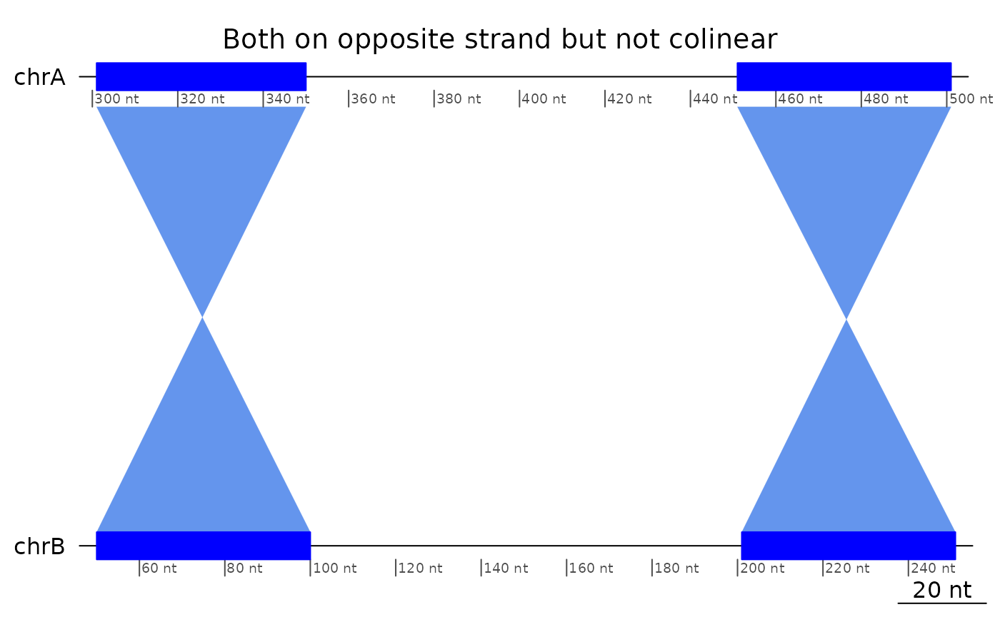
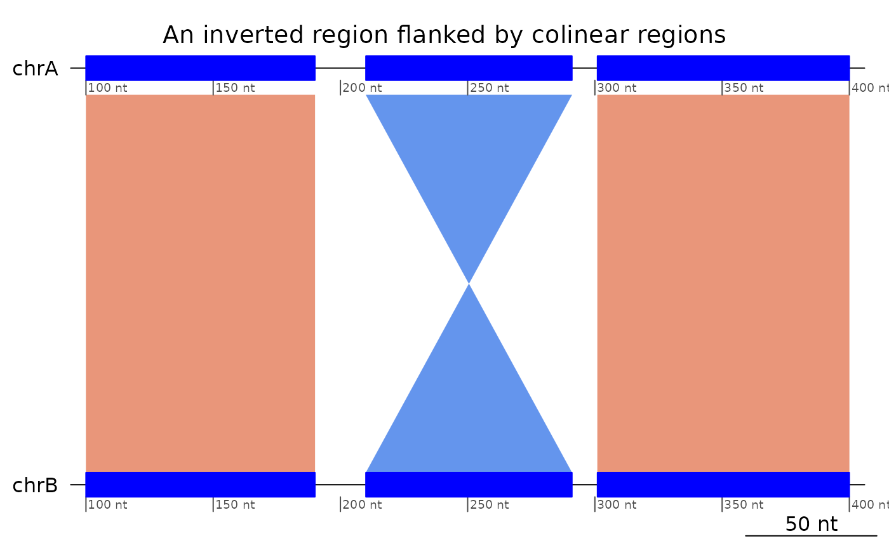
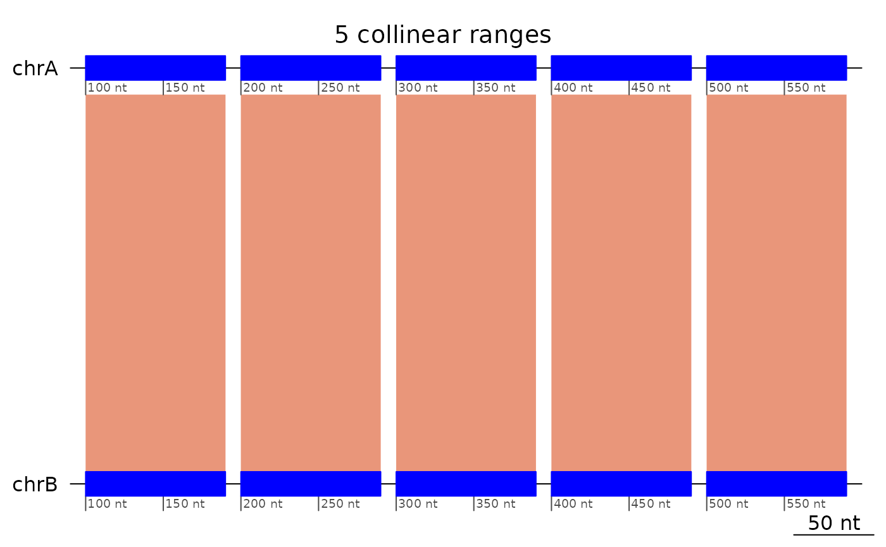
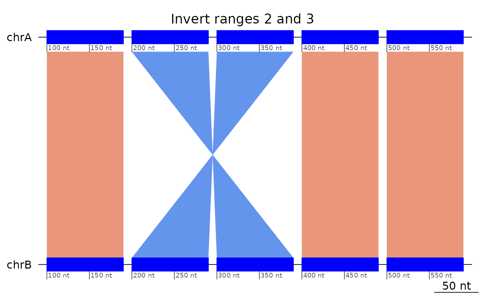
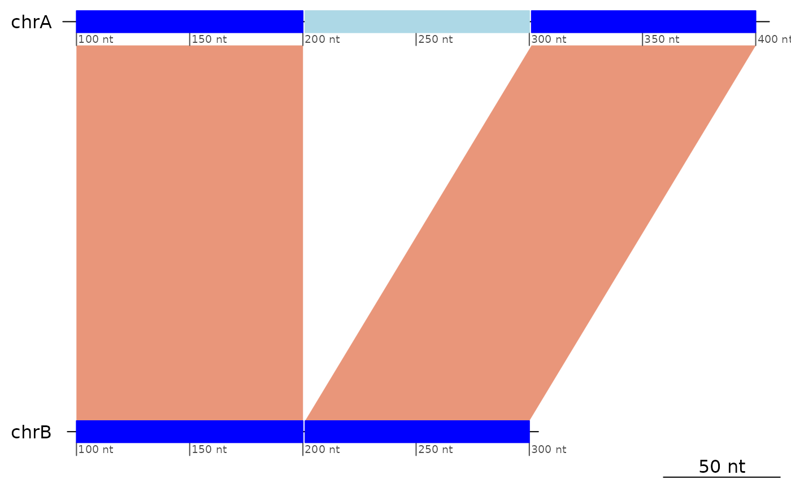
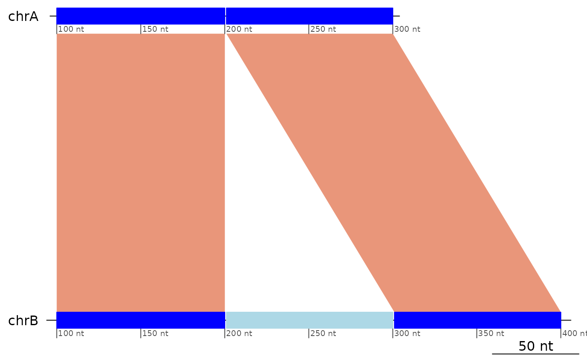

# Structural Variants

## Structural Variants

The
[`GBreaks()`](https://oist.github.io/GenomicBreaks/reference/GBreaks-class.md)
objects here are provided as *lazy data* and by convention their name
always start with `example`.

### Colinearity

#### Definition

We define *structural variants* as patterns of interruption of the
colinearity between genomes.

Colinearity is a property of pairs of mapped regions.

``` r
plotApairOfChrs(exampleColinear, main = "Two colinear regions")
```


Regions that mapped on reverse strands **and** in reverse order are also
colinear.

``` r
plotApairOfChrs(reverse(exampleColinear), main = "Two colinear regions on different strands")
```


Regions that are only in reverse order, or only mapped on opposite
strands **are not colinear**.

``` r
plotApairOfChrs(exampleNotColinear, main = "Same strand but not colinear")
```


``` r
plotApairOfChrs(reverse(exampleNotColinear), main = "Both on opposite strand but not colinear")
```



In this example, the syntenic chromosomes are called `chrA` and `chrB`,
but the names do not matter.

#### Technical details

Remember that the
[`flagColinearAlignments()`](https://oist.github.io/GenomicBreaks/reference/flagColinearAlignments.md)
function puts the flag on the first member of the pair, ordered by the
sequence on the *target* genome.

``` r
flagColinearAlignments(exampleColinear)
```

    ## GBreaks object with 2 ranges and 2 metadata columns:
    ##       seqnames    ranges strand |        query  colinear
    ##          <Rle> <IRanges>  <Rle> |    <GRanges> <logical>
    ##   [1]     chrA   100-150      + | chrB:100-150      TRUE
    ##   [2]     chrA   251-300      + | chrB:251-300     FALSE
    ##   -------
    ##   seqinfo: 1 sequence from an unspecified genome

``` r
flagColinearAlignments(reverse(exampleColinear))
```

    ## GBreaks object with 2 ranges and 2 metadata columns:
    ##       seqnames    ranges strand |        query  colinear
    ##          <Rle> <IRanges>  <Rle> |    <GRanges> <logical>
    ##   [1]     chrA   301-350      - | chrB:251-300      TRUE
    ##   [2]     chrA   451-501      - | chrB:100-150     FALSE
    ##   -------
    ##   seqinfo: 1 sequence from an unspecified genome

``` r
# Note the tolerance window
flagColinearAlignments(exampleColinear, tol = 100)
```

    ## GBreaks object with 2 ranges and 2 metadata columns:
    ##       seqnames    ranges strand |        query  colinear
    ##          <Rle> <IRanges>  <Rle> |    <GRanges> <logical>
    ##   [1]     chrA   100-150      + | chrB:100-150     FALSE
    ##   [2]     chrA   251-300      + | chrB:251-300     FALSE
    ##   -------
    ##   seqinfo: 1 sequence from an unspecified genome

``` r
# Strandless mappings can also be colinear
exampleColinear |> plyranges::mutate(strand = "*") |> flagColinearAlignments()
```

    ## GBreaks object with 2 ranges and 2 metadata columns:
    ##       seqnames    ranges strand |        query  colinear
    ##          <Rle> <IRanges>  <Rle> |    <GRanges> <logical>
    ##   [1]     chrA   100-150      * | chrB:100-150      TRUE
    ##   [2]     chrA   251-300      * | chrB:251-300     FALSE
    ##   -------
    ##   seqinfo: 1 sequence from an unspecified genome

``` r
flagColinearAlignments(exampleNotColinear)
```

    ## GBreaks object with 2 ranges and 2 metadata columns:
    ##       seqnames    ranges strand |        query  colinear
    ##          <Rle> <IRanges>  <Rle> |    <GRanges> <logical>
    ##   [1]     chrA   100-150      + | chrB:201-251     FALSE
    ##   [2]     chrA   251-300      + |  chrB:50-100     FALSE
    ##   -------
    ##   seqinfo: 1 sequence from an unspecified genome

To make some sanity checks against the other flagging functions there is
also an object containing three colinear mappings.

``` r
flagColinearAlignments(exampleColinear3)
```

    ## GBreaks object with 3 ranges and 2 metadata columns:
    ##       seqnames    ranges strand |        query  colinear
    ##          <Rle> <IRanges>  <Rle> |    <GRanges> <logical>
    ##   [1]     chrA   100-200      + | chrB:100-200      TRUE
    ##   [2]     chrA   201-300      + | chrB:201-300      TRUE
    ##   [3]     chrA   301-400      + | chrB:301-400     FALSE
    ##   -------
    ##   seqinfo: 1 sequence from an unspecified genome

#### Limitation

At the moment we can not study the structural variants that are entirely
contained in an aligned region, for instance an indel represented as an
alignment gap.

### Inversions

#### Trivial inversions

Trivial inversions are triplets of mapped regions that would be colinear
if the strand of the second one were reversed. Note that, like for
colinear patterns, the flag is put on the first mapping of the triplet.

``` r
exampleInversion |> flagColinearAlignments() |> flagInversions()
```

    ## GBreaks object with 3 ranges and 3 metadata columns:
    ##       seqnames    ranges strand |        query  colinear   inv
    ##          <Rle> <IRanges>  <Rle> |    <GRanges> <logical> <Rle>
    ##   [1]     chrA   100-190      + | chrB:100-190     FALSE  TRUE
    ##   [2]     chrA   210-291      - | chrB:210-291     FALSE FALSE
    ##   [3]     chrA   301-400      + | chrB:301-400     FALSE FALSE
    ##   -------
    ##   seqinfo: 1 sequence from an unspecified genome

``` r
plotApairOfChrs(exampleInversion, main = "An inverted region flanked by colinear regions")
```



``` r
plotApairOfChrs(reverse(exampleInversion), main = "An inverted region flanked by colinear regions (opposite strands)")
```


``` r
# Removing the inversion restores colinearity
exampleInversion[-2] |> flagColinearAlignments()
```

    ## GBreaks object with 2 ranges and 2 metadata columns:
    ##       seqnames    ranges strand |        query  colinear
    ##          <Rle> <IRanges>  <Rle> |    <GRanges> <logical>
    ##   [1]     chrA   100-190      + | chrB:100-190      TRUE
    ##   [2]     chrA   301-400      + | chrB:301-400     FALSE
    ##   -------
    ##   seqinfo: 1 sequence from an unspecified genome

``` r
# Flipping the inversion restores colinearity
exampleInversion |> plyranges::mutate(strand = "+") |> flagColinearAlignments()
```

    ## GBreaks object with 3 ranges and 2 metadata columns:
    ##       seqnames    ranges strand |        query  colinear
    ##          <Rle> <IRanges>  <Rle> |    <GRanges> <logical>
    ##   [1]     chrA   100-190      + | chrB:100-190      TRUE
    ##   [2]     chrA   210-291      + | chrB:210-291      TRUE
    ##   [3]     chrA   301-400      + | chrB:301-400     FALSE
    ##   -------
    ##   seqinfo: 1 sequence from an unspecified genome

``` r
# Note the tolerance window
flagInversions(exampleInversion, tol = 10)
```

    ## GBreaks object with 3 ranges and 2 metadata columns:
    ##       seqnames    ranges strand |        query   inv
    ##          <Rle> <IRanges>  <Rle> |    <GRanges> <Rle>
    ##   [1]     chrA   100-190      + | chrB:100-190 FALSE
    ##   [2]     chrA   210-291      - | chrB:210-291 FALSE
    ##   [3]     chrA   301-400      + | chrB:301-400 FALSE
    ##   -------
    ##   seqinfo: 1 sequence from an unspecified genome

#### Double inversions

Double inversions are the result of two overlapping trivial inversions,
and are detected with a different approach, implemented in the
[`flagDoubleInversions()`](https://oist.github.io/GenomicBreaks/reference/flagDoubleInversions.md)
function.

Here we construct a double inversion in 3 steps:

1.  First, we start from 5 collinear ranges,
2.  then we invert ranges 2 and 3,
3.  then we invert ranges 3 an 4 (of step 2).

show a triplet resulting from a double inversion, flanked by two regions
that did not move.

``` r
exampleColinear5 |> plotApairOfChrs(main = "5 collinear ranges")
```



``` r
exampleInversion5uncollapsed |> plotApairOfChrs(main = "Invert ranges 2 and 3")
```



``` r
exampleDoubleInversion1 |> plotApairOfChrs(main = "Invert ranges 3 and 4 of the previous step")
```


Same story but showing coalesced alignments.

``` r
exampleColinear5 |> coalesce_contigs() |> plotApairOfChrs()
```


``` r
exampleInversion5uncollapsed |> coalesce_contigs() |> plotApairOfChrs()
```


``` r
exampleDoubleInversion1 |> coalesce_contigs() |> plotApairOfChrs()
```


Given the double inversion example above, but not its history, we can
deduce the coordinates of the inversions (pairs of breakpoints), but not
the order in which they took place.

#### Nested inversions

The
[`?flagInversions`](https://oist.github.io/GenomicBreaks/reference/flagInversions.md)
algorithm only detects the simplest cases. In order to detect nested
inversions, the inner ones have to be removed.

``` r
exampleNestedInversions |> plotApairOfChrs()
```


``` r
exampleNestedInversions |> flagInversions()
```

    ## GBreaks object with 5 ranges and 2 metadata columns:
    ##       seqnames    ranges strand |        query   inv
    ##          <Rle> <IRanges>  <Rle> |    <GRanges> <Rle>
    ##   [1]     chrA   100-190      + | chrA:100-190 FALSE
    ##   [2]     chrA   200-290      - | chrA:400-490  TRUE
    ##   [3]     chrA   300-390      + | chrA:300-390 FALSE
    ##   [4]     chrA   400-490      - | chrA:200-290 FALSE
    ##   [5]     chrA   500-590      + | chrA:500-590 FALSE
    ##   -------
    ##   seqinfo: 1 sequence from an unspecified genome

``` r
(flipped <- (exampleNestedInversions |> flagInversions() |> flipInversions()))
```

    ## GBreaks object with 5 ranges and 1 metadata column:
    ##       seqnames    ranges strand |        query
    ##          <Rle> <IRanges>  <Rle> |    <GRanges>
    ##   [1]     chrA   100-190      + | chrA:100-190
    ##   [2]     chrA   200-290      - | chrA:400-490
    ##   [3]     chrA   300-390      - | chrA:300-390
    ##   [4]     chrA   400-490      - | chrA:200-290
    ##   [5]     chrA   500-590      + | chrA:500-590
    ##   -------
    ##   seqinfo: 1 sequence from an unspecified genome

``` r
flipped |> plotApairOfChrs()
```


``` r
flipped |> coalesce_contigs() |> flagInversions()
```

    ## GBreaks object with 3 ranges and 3 metadata columns:
    ##       seqnames    ranges strand |        query     score   inv
    ##          <Rle> <IRanges>  <Rle> |    <GRanges> <integer> <Rle>
    ##   [1]     chrA   100-190      + | chrA:100-190        91  TRUE
    ##   [2]     chrA   200-490      - | chrA:200-490       291 FALSE
    ##   [3]     chrA   500-590      + | chrA:500-590        91 FALSE
    ##   -------
    ##   seqinfo: 1 sequence from an unspecified genome

### Transolocations

If a region has moved, but is not an inversion, then it is a
translocation.

``` r
exampleTranslocation |> flagColinearAlignments() |> flagInversions()
```

    ## GBreaks object with 3 ranges and 3 metadata columns:
    ##       seqnames    ranges strand |        query  colinear   inv
    ##          <Rle> <IRanges>  <Rle> |    <GRanges> <logical> <Rle>
    ##   [1]     chrA   100-200      + | chrB:100-200     FALSE FALSE
    ##   [2]     chrA   201-300      + | chrC:201-300     FALSE FALSE
    ##   [3]     chrA   301-400      + | chrB:301-400     FALSE FALSE
    ##   -------
    ##   seqinfo: 1 sequence from an unspecified genome

``` r
plotApairOfChrs(exampleTranslocation)
```


It does not matter if the region moved on the minus strand

``` r
exampleTranslocation2 |> flagColinearAlignments() |> flagInversions()
```

    ## GBreaks object with 3 ranges and 3 metadata columns:
    ##       seqnames    ranges strand |        query  colinear   inv
    ##          <Rle> <IRanges>  <Rle> |    <GRanges> <logical> <Rle>
    ##   [1]     chrA   100-200      + | chrB:100-200     FALSE FALSE
    ##   [2]     chrA   201-300      - | chrC:201-300     FALSE FALSE
    ##   [3]     chrA   301-400      + | chrB:301-400     FALSE FALSE
    ##   -------
    ##   seqinfo: 1 sequence from an unspecified genome

``` r
plotApairOfChrs(exampleTranslocation2)
```


### Insertions / Deletions (indels)

NOTE that searching for insertion/deletions make little sense in
one-to-one alignment unless the maximal distance for colinearity is set
to a meaningful value.

``` r
exampleDeletion
```

    ## GBreaks object with 3 ranges and 1 metadata column:
    ##       seqnames    ranges strand |        query
    ##          <Rle> <IRanges>  <Rle> |    <GRanges>
    ##   [1]     chrA   100-200      + | chrB:100-200
    ##   [2]     chrA   201-300      + | chrC:401-500
    ##   [3]     chrA   301-400      + | chrB:201-300
    ##   -------
    ##   seqinfo: 1 sequence from an unspecified genome

``` r
plotApairOfChrs(exampleDeletion)
```



``` r
exampleInsertion
```

    ## GBreaks object with 3 ranges and 1 metadata column:
    ##       seqnames    ranges strand |        query
    ##          <Rle> <IRanges>  <Rle> |    <GRanges>
    ##   [1]     chrA   100-200      + | chrB:100-200
    ##   [2]     chrA   201-300      + | chrB:301-400
    ##   [3]     chrC   401-500      + | chrB:201-300
    ##   -------
    ##   seqinfo: 2 sequences from an unspecified genome

``` r
plotApairOfChrs(exampleInsertion)
```


