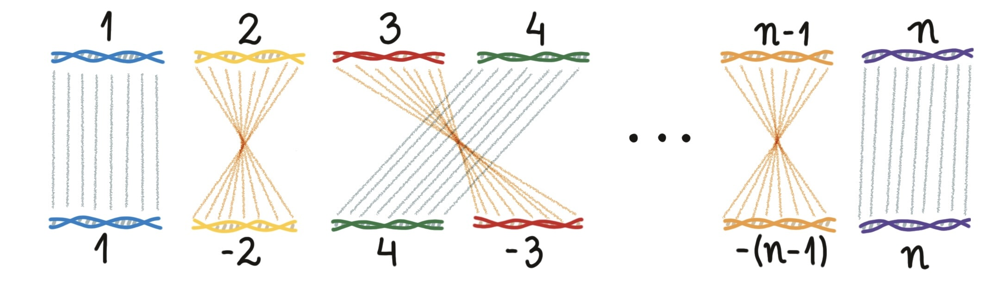
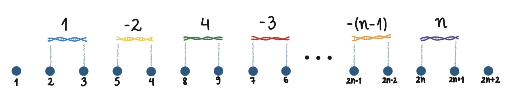
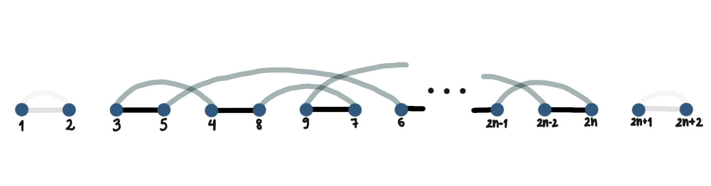

```{r setup, include=FALSE}
knitr::opts_chunk$set(echo = TRUE)
```

```{r}
source("InversionsAlgorithm.R")
```

# Genome Rearrangement Problem

Genome rearrangement is an important area in computational biology that looks at how the genetic makeup of organisms has changed over time. The main question is: given two genomes and a list of ways that genomes can evolve, how can we transform one genome into another through a series of changes?

There are two fundamental questions to formulate our solution to this problem:

1)  What is a genome? The term 'genome' can refer to DNA that is either in a long line or in a circle. It can be made up of one or many chromosomes. Understanding the structure of genomes is crucial because different organisms have different genome structures.

2)  Types of changes: There are many ways genomes can change, including moving parts of the DNA to different places, swapping large sections between chromosomes, reversing sections of a chromosome, changing small parts of the DNA sequence, adding or removing DNA, and moving DNA segments either by cutting and pasting or copying and pasting. These changes can happen within a chromosome or between chromosomes, adding layers of complexity. Finding solutions to the genome rearrangement problem means creating algorithms (sets of rules for solving problems) that can identify the best series of changes to explain how one genome evolved into another. This isn't just puzzle solving; it can have practical applications in understanding genetic dynamics, the history of life's evolution, and how genetic diversity occurs.

## How to relate two genomes

The starting point is define a relation between two genomes. Dealing with mathematics implies on having well defined structures to work with. In our case, they are *permutations*.

Suppose we have a DNA sequence which we consider as standard (target), where each DNA fragment is represent by a number. Lets get a toy sequence with 7 DNA fragments.

$$
target ~~~ \rightarrow~~~  1~~~  2~~~  3~~~  4~~~  5~~~  6~~~  7
$$

```{r}
target_sequence <- c(1, 2, 3, 4, 5, 6, 7)
```

A signed permutation vector $\pi$ can be represented, for example, by

$$
\pi = [2, 3, -5, -4, -6, 7, 1],
$$

where a negative number means an inversion.

But how can we interpret the permutation?

Our target is the identity sequence. For the first DNA fragment of the query our permutation says

$$
\pi_1 = 2,
$$

which means the first element in the new sequence should be the second element of the original vector. Similarly, we have $\pi_2=3$, which means the fragment 3 of the target is located on the second position of the query. Hence, the vector representing the genome sequence is the same as the permutation vector. Note that this just happens because we assume the target sequence is the identity, but this is not true in general. However, we will always assume that one of our genomes is the identity.

```{r}
query_sequence = c(2, 3, -5, -4, -6, 7, 1)
```



## Transforming a signed sequence into an unsigned sequence

It doesn't take much time to get in trouble dealing with the minus signal in the permutation. We are doing math, but the minus signal is not about negative numbers, it is about the orientation of a fragment.

To have more interpretability in our structure, we can think every fragment has a beginning and an ending. Therefore, we can represent a fragment as a pair of consecutive numbers, where we replace each positive element $i$ of $\pi$ by $(2i, 2i+1)$ and each negative element $-i$ of $\pi$ by $(2i+1, 2i)$. We also add two elements $\pi(0)=1$ and $\pi(n+1) = 2n+2$, where $n$ is the number of DNA fragments - these numbers will be useful to identify breakpoints at the beginning and end of the strand. The reason to use this structure is the fact that it is way much better to apply graph approaches for solving the genome rearrangement problem, instead of using signals to represent an inversion. Let's represent our example:

```{r}
query_sequence_unsig <- sig2unsig(query_sequence)
query_sequence_unsig
```



# Genome Rearrangement Algorithm - Sorting by Reversals

In 1999, Hannenhalli and Pevzner established an approach to sort a genome by inversions in their work "Transforming Cabbage into Turnip: Polynomial Algorithm for Sorting Signed Permutations by Reversals", published on Journal of the ACM. The terms "inversions" and "reversals" are synonymous and are used here interchangeably.

Although the algorithm can calculate the exact minimal number of inversions required to sort the genome and find them, its complexity is quite high: $O(n^5)$, where $n$ is the number of DNA fragments. It takes around 3 hours to sort 100 fragments and it gets very slow for larger permutations.

Here, we are going to explore how to decrease this time. But first, lets learn some lessons with Hannenhalli and Pevzner, understanding the core elements of their algorithm: breakpoints, cycles and hurdles. We are also providing the implementation of their algorithm, once it is not given by the authors.

## Genome representation

The algorithm works in order to rearrange a numeric sequence by inversions in order to obtain the sorted sequence $1, 2, ..., n$, where $n$ is the number of DNA fragments from a one-to-one relationship of two genomes (actually, we are going to get the sorted unsigned sequence $1, 2, ..., 2n+1, 2n+2$).

Therefore, to transform a genome into another, we have to define one genome as an identity sequence, and the second one as the unsigned permutation from the first one - Genome Breaks package is able to do give you this vector. For instance,

```{r}
system.file("extdata/NeuCra__PodCom.III__7.gff3.gz", package = "GenomicBreaks") |> load_genomic_breaks(type = 'match') |> coalesce_contigs() |> head(100) |> bpGraph()
```

There are two important parameters here:

1)  we need to get a one-to-one relation between the genomes, so `type = 'match'`;

2)  taking coalescent contigs is important to reduce the number of fragments, and hence the complexity of the problem. Colinear fragments would not be separated by the algorithm.

## The inversion operation

Some carry is required when applying operations in this type of representation above. A fragment $i$ will be represented by $2|i|$ and $2|i|+1$ (not necessarily in this order), hence, they cannot be separated - imagine these numbers are flanking a DNA fragment, a molecule. You don't want to break it, right?

Hence, an inversion operation needs to start in an even index and finish in an odd index, because any DNA fragment starts in an even index and finishes in an odd index - by index we mean the position on the vector, not the value itself.

```{r}
print(query_sequence_unsig)

inversion(query_sequence_unsig, 2, 13)
```

If we perform some inversion operations, we can sort the genome:

```{r}
inversion(query_sequence_unsig, 2, 13) |> inversion(2, 15) |> inversion(8, 11) |> inversion(12, 13) |> inversion(2, 3)
```

Our problem is finding these sequence of rearrangements with a minimal number of movements, called *reversal distance*, written as $d(\pi)$.

In order to get a sequence of inversions, it is sufficient to type

```{r}
inversions_rearrangement(query_sequence_unsig)
```

or, if you don't have the unsigned permutation,

```{r}
inversions_rearrangement(query_sequence, unsigned=FALSE)
```

Each line represents the positions of the inversion in the unsigned sequence.

## Creating a breakpoint graph

With the unsigned permutation vector we have to create a structure called *breakpoint graph*. Each element of our vector is a node, so for every DNA fragment, we have a node representing its beginning and a node representing its ending.

```{r Creating and visualizing a breakpoint graph}

g <- breakpoint_graph(query_sequence_unsig)

#plot(g, edge.color = E(g)$color, edge.width = 4, vertex.size = 20, vertex.color="lightgreen")
```

Each number in a node represents an extremity of a fragment (remember that we have created a unsigned permutation, where each fragment $i$ was replaced by $2i, 2i+1$ and we add the extremities $1$ and $2n+2$, where $n$ is the number of fragments).

A black edge is created when two fragments are adjacent but not consecutive, i.e., we have

$$ |i-j|\neq 1, ~~~~~~ |\pi_i - \pi_j|=1  $$.

Hence, they indicate the presence of a breakpoint. In the unsigned permutation, we create a black edge between $2i+1$ and $2j$ if these conditions are satisfied.

A gray edge is created when two fragments are consecutive but not adjacent,

$$ |i-j|= 1, ~~~~~~ |\pi_i - \pi_j|\neq 1  $$.

Gray edges indicates "what we should have", or which fragment should come next. In the unsigned permutation, we create a gray edge between $2i+1$ and $2j$ if these conditions are satisfied.



### Counting breakpoints and cycles in the breakpoint graph

We can define by cycles all connected components with more than one node on the breakpoint graph. Lets write $b(\pi)$ for the number of breakpoints and $c(\pi)$ for the number of cycles in the breakpoint graph.

```{r Count breakpoints and cycles}

#count the number of breakpoints (including artificial extremities)
bp_count(query_sequence_unsig)

#count the number of cycles excluding single nodes
cycle_count(g)
```

In our example, $b(\pi)=12$ and $c(\pi)=6$.

In 1996, Bafna and Pevzner showed that every inversion can change the parameter $b(\pi) - c(\pi)$ by at most 1. Therefore, we can have a lower bound for the reversal distance

$$d(\pi) \geq b(\pi) - c(\pi)$$ $b(\pi)$ and $c(\pi)$ are the first two of four very important elements to solve our problem. [Keep them in mind!]{style="color:blue"}

Closing the gap between the reversal distance and this lower bound relies on a graph structure called **hurdle**. It doesn't look there is an intuition or an interpretation for this type of structure. The idea is related to identifying structures that make the rearrangement problem more difficult to solve and in which type of structure we are allowed to perform movements or not. The way these structures are defined depends on the convenience for the solution of specific problems. There is a lot of sightly different definitions for hurdles, but here we are going to explain the structure used by Hannenhalli and Pevzner.

In a nutshel, hurdle is a denomination to a sets of cycles which has certain characteristics on their edges. There is another concept, **superhurdle**, the way you call a hurdle $h$ if a new hurdle is created when $h$ is removed from the graph. Then, with the number of superhurdles we can calculate a binary parameter called 
**fortress**. Together with the number of breakpoints and cycles, it is possible to calculate the minimal number of inversions if you have the number of hurdles and the value of fortress.

At this point, you can go directly for the section "Reversal distance", once I mentioned all the required pieces to calculate it. But if you want to read more about hurdles, I am trying to give a quick idea about how to find them below.

### Orientation of edges and cycles

Identifying hurdles depends on some characteristics for gray edges, cycles and how this characteristics are related. 

A gray edge is called oriented when the sum of the positions (index) of the nodes in the permutation vector is even. Otherwise, the edge is unoriented.

Cycles having at least one oriented gray edge are oriented, and unoriented if all gray edges are unoriented.

Unoriented cycles doesn't have a proper inversion, i.e., an inversion that helps to reach the solution of our problem. And unoriented cycles are the pieces that can form hurdles. 

Here it comes a very interesting thought: lets think about probability. If we have a very large structure, it becomes less likely to have a cycle with all edges being unoriented. In fact, what happens at the end of the day is, for real data, we barely observe hurdles. And this is what will save our lives later.

### Extension of gray edges

An extension of an edge is the interval given by the positions of its nodes in the permutation vector. So a match function in R finds the extension of an edge, given the permutation vector.

We need to find if two gray nodes overlap (i.e., their extensions overlap), but none of them contains the another one.
When this happens, we say that the two gray nodes are "interleaving".
If $e_1 \in C_1$ and $e_2 \in C_2$ are two gray edges interleaving, we can say $C_1$ and $C_2$ are two cycles interleaving.

At this point, we need to create another structure to save the required information to decide our inversions. This structure is a graph constructed from our cycles.

## Components graph

Lets create a new graph where each node represents a cycle on our breakpoint graph. If two cycles interleaves, we create a link between them:

```{r}
h <- components_graph(g, query_sequence_unsig)

plot(h, edge.width = 4, vertex.size = 20)
```

Each cycle can be oriented or unoriented. So this is a node attribute. Here, blue nodes are unoriented cycles, while orange nodes are oriented cycles. Hence, a component with only blue nodes is an unoriented component.

Now, we need analyze the connected components of this graph. A connected component is oriented if it has at least one oriented node, and unoriented otherwise.

For each unoriented component, lets get the union of the extension of all gray edges. The extremities of this union will be the extension of the unoriented component.

The extension of unoriented components essentially allows us to find what we define by hurdles.

## Hurdles

```{r Counting hurdles and superhurdles}

info <- hurdles_count(g, query_sequence_unsig)

info
```

The extensions of unoriented components are intervals of natural numbers. They can:

-   be contained by another extensions of unoriented components,

-   contain another extensions of unoriented components,

-   none of those above.

These possibilities allow us to classify an unoriented component as a *minimal hurdle* or a (possibly) *greatest hurdle*, with the following rules:

| Contains | Is contained | Minimal hurdle | Greatest hurdle |
|:--------:|:------------:|:--------------:|:---------------:|
|   yes    |     yes      |       no       |       no        |
|   yes    |      no      |       no       |    possibly     |
|    no    |     yes      |      yes       |       no        |
|    no    |      no      |      yes       |       no        |

If there is a possible greatest hurdle, it needs to satisfy the following conditions:

-   its extension covers all another hurdles

-   there is no gray edge separating hurdles

If there is a greatest hurdle, it is unique. We will write the number of hurdles of a permutation $\pi$ as $h(\pi)$.

## Superhurdles

A hurdle is considered a *superhurdle* if it "protects" another unoriented component which is not a hurdle. This means that, if this hurdle is removed from the graph, the "protected" unoriented component turns into a hurdle.

It is necessary to calculate them to find another required calculation to find the reversal distance, called *fortress*.

```{r}

superhurdles_count(info, g, query_sequence_unsig)

```

## Fortress

A permutation is a *fortress* if the number of hurdles is odd and all hurdles are superhurdles:

$f(\pi) = 1$ if $\pi$ is a fortress, $f(\pi) = 0$ otherwise.

```{r Is it fortress?}
#analyze if the permutation is a fortress
is_fortress(info)
  
  #return 1 if it is fortress
  #return 0 otherwise
  
```

## Reversal distance

Finally, we can calculate the reversal distance, given by

$$t(\pi) = b(\pi) - c(\pi) + h(\pi) + f(\pi) $$ \# Performing the rearrangement

Clearly, what we want to do is to decrease the number of the reversal distance. Lets say we get a pair of positions to perform an inversion, resulting on the permutation $\pi_2$. It was demonstrated by Hannenhalli and Pevzner that the reversal distance can be decreased by at most 1. Hence, a permutation must be done in order to have

$$t(\pi_2) - t(\pi) = -1$$.

To sort the DNA sequence by inversions, therefore, we search iterativelly along all possible inversions and calculate the parameter above. If some permutation reduces the reversal distance, we perform this reversal. We do this until have our sequence sorted.

```{r Examples from the paper}

# #query_sequence <- c(5, 7, 6, 8, 1, 3, 2, 4)
# 
# #query_sequence <- c(2, 4, 3, 5, 7, 6, 8, 1)
# 
# #query_sequence <- c(1, -5, 4, -3, 2)
# 
# #query_sequence_unsig <- sig2unsig(query_sequence)
# 
# #query_sequence_unsig <- c(0,45,46,43,44,1,2,7,8,13,14,11,12,9,10,15,16,5,6,3,4,17,18,23,24,29,30,27,28,25,26,31,32,37,38,35,36,33,34,39,40,21,22,19,20,41,42,47) +1
# 
#query_sequence_unsig <- c(0,45,46,43,44,1,2,7,8,13,14,11,12,9,10,32,31,26,25,28,27,30,29,24,23,18,17,4,3,6,5,16,15,37,38,35,36,33,34,39,40,21,22,19,20,41,42,47) + 1

```

```{r Performing the rearrangements}
start_time <- Sys.time()
result <- inversions_rearrangement(query_sequence_unsig)
end_time <- Sys.time()

print(result)

end_time - start_time
```

```{r Sequence from GenomicBreaks}
# query_sequence_unsig <- system.file("extdata/NeuCra__PodCom.III__7.gff3.gz", package = "GenomicBreaks") |> load_genomic_breaks(type = 'match') |> coalesce_contigs() |> head(100) |> bpGraph()
# 
# start_time <- Sys.time()
# result <- inversions_rearrangement(new_nema)
# end_time <- Sys.time()
# 
# print(result)
# 
# end_time - start_time
```

However, the code below, which is related to a real sequence, takes around 3,5 hours, even having just 100 fragments. It becomes inconvenient to work with large data :(

What can we do now?

## Searching for inversions using a lag difference

The function `diff` is such that the computed result is equal to the successive differences `s[2:(2n+2)] - s[1:(2n+1)]`. If we ask the diff of our permutation vector, we get a very interesting structure from the lagged difference $l$:

$$
l = [\pm a_1, ~~\pm1,~~ \pm a_2, ~~\pm1, ~~\pm a_3, ~~\cdots,~~ \pm1,~~ \pm a_{n+1}],
$$

where $\pm$ indicates if the sequence is inverted (negative) or not (positive), and $a_i \in \mathbb{N}$, $i\in (1, 2, \cdots, n+1)$, represents if there is a break-point or not. A break-point is present when $|a_i| \neq 1$.

Therefore, we can try to characterize the signatures of different structures created by rearrangement and look for them with a sliding window. The easiest thing to do is fix all simple inversions.

### Simple inversions

Once we are taking coalescent contigs, the lagged difference for a single inversion will look like:

```{r}
inversion(1:8, 4, 5) |> diff()
```

Or in the opposite strand:

```{r}
inversion(1:8, 4, 5) |> inversions(2,7) |> diff()
```

## Searching for proper inversions without calculating hurdles

As I mentioned in the explanation about edge orientation, something good happens with real data: the probability to having hurdles decreases as long as the data gets bigger. If we take this into consideration, we save a lot of time. A vector with 100 pieces of DNA taking 3,5 hours to be rearranged by the algorithm before, now can be done in 5 minutes.

If we consider the number of hurdles is zero, the minimal number of inversions is given by

$$t(\pi) = b(\pi) - c(\pi) $$

As we saw before, a permutation must be done in order to have

$$t(\pi_2) - t(\pi) = -1$$.

After fixing simple inversions with the pattern search, we are going to pass through the sequence until solving the problem or "get stuck" on a permutation vector (which means we made an entire loop on the sequence and did not perform any rearrangement). But at this point, we can check if it is possible to break our permutation into smaller permutations and solve them using the original algorithm. 

